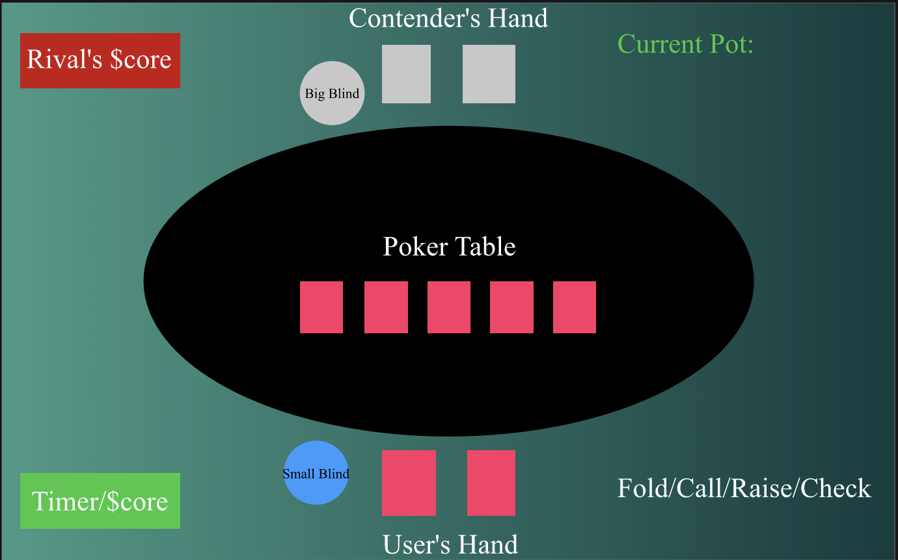

# Texas Hold Em' Poker 

Since this is the first game I will be building, I chose to keep it somewhat simple and attempt to make a poker game. I'll start off by having the user face off against one computer and gradually add more contenders after I can make it function in a 1 v 1 match. 

## Poker Origins 
As early as the sixteenth century, Germans played a bluffing game called "Pochen." It later developed into a French version, called "Poque," which was eventually brought over to New Orleans and played on the riverboats that plied the Mississippi. 

In the 1830s, the game was refined further and became known as Poker. During the Civil War, the key rule about drawing cards to improve one's hand was added. A variation - Stud Poker - appeared at about the same time. There are hundreds of versions of Poker, and the game is played not only in private homes, but also in countless Poker rooms at famous casinos. Poker can be played socially for pennies or matchsticks, or professionally for thousands of dollars.

There is plenty of luck in Poker, but the game requires incredibly great skill as well, and each player is the master of his own fate.

Source: [Basics Of Poker](https://bicyclecards.com/how-to-play/basics-of-poker/)

## Texas Hold Em' Rules
**OBJECT OF THE GAME:**  
Before and after each card(s) is revealed, players take turns to bet. To stay in the hand and see the next card, all players must have put the same amount of chips in the pot as each other.

The best poker hand wins the pot.

**THE DEAL:**  
Every player is dealt two cards, for their eyes only.

The dealer spreads five cards - three at once, then another, then another - which can be used by all players to make their best possible five-card hand.

**THE PLAY:**  
In Hold'em, each player is dealt two private cards (known as ‘hole cards’) that belong to them alone. Five community cards are dealt face-up, to form the ‘board’. All players in the game use these shared community cards in conjunction with their own hole cards to each make their best possible five-card poker hand. In Hold'em, a player may use any combination of the seven cards available to make the best possible five-card poker hand, using zero, one or two of their private hole cards.

**The Blinds:**  
In Hold'em, a marker called ‘the button’ or ‘the dealer button’ indicates which player is the dealer for the current game. Before the game begins, the player immediately clockwise from the button posts the "small blind", the first forced bet. The player immediately clockwise from the small blind posts the "big blind", which is typically twice the size of the small blind, but the blinds can vary depending on the stakes and betting structure being played.

Now, each player receives his or her two hole cards. Betting action proceeds clockwise around the table, starting with the player ‘under the gun’ (immediately clockwise from the big blind).

**Player Betting Options:**  
In Hold'em, as with other forms of poker, the available actions are ‘fold’, ‘check’, ‘bet’, ‘call’ or ‘raise’. Exactly which options are available depends on the action taken by the previous players. If nobody has yet made a bet, then a player may either check (decline to bet, but keep their cards) or bet. If a player has bet, then subsequent players can fold, call or raise. To call is to match the amount the previous player has bet. To raise is to not only match the previous bet, but to also increase it.

**Pre-Flop:**  
After seeing his or her hole cards, each player now has the option to play his or her hand by calling or raising the big blind. The action begins to the left of the big blind, which is considered a ‘live’ bet on this round. That player has the option to fold, call or raise. For example, if the big blind was \$2, it would cost \$2 to call, or at least $4 to raise. Action then proceeds clockwise around the table.

Betting continues on each betting round until all active players (who have not folded) have placed equal bets in the pot.

**The Flop:**  
Now, three cards are dealt face-up on the board. This is known as ‘the flop’. In Hold'em, the three cards on the flop are community cards, available to all players still in the hand. Betting on the flop begins with the active player immediately clockwise from the button. The betting options are similar to pre-flop, however if nobody has previously bet, players may opt to check, passing the action to the next active player clockwise.

**The Turn:**  
When the betting action is completed for the flop round, the ‘turn’ is dealt face-up on the board. The turn is the fourth community card in Hold'em (and is sometimes also called ‘Fourth Street’). Another round of betting ensues, beginning with the active player immediately clockwise from the button.

**The River:**  
When betting action is completed for the turn round, the ‘river’ or ‘Fifth Street’ is dealt face-up on the board. The river is the fifth and final community card in a Hold'em game. Betting again begins with the active player immediately clockwise from the button, and the same betting rules apply as they do for the flop and turn, as explained above.

**The Showdown:**  
If there is more than one remaining player when the final betting round is complete, the last person to bet or raise shows their cards, unless there was no bet on the final round in which case the player immediately clockwise from the button shows their cards first. The player with the best five-card poker hand wins the pot. In the event of identical hands, the pot will be equally divided between the players with the best hands. Hold'em rules state that all suits are equal.

After the pot is awarded, a new hand of Hold'em is ready to be played. The button now moves clockwise to the next player, blinds and antes are once again posted, and new hands are dealt to each player.  

Source: [Texas Hold Em' Rules](https://bicyclecards.com/how-to-play/texas-holdem-poker/) 

## Card Values/Scoring
*For this variation of Poker I will not be including wildcards such as,  a joker, the two one-eyed jacks, or the four deuces. This means that the game will be played without the possibility of getting a hand with 5 of a kind. For those not familiar with how to get 5 of a kind here it is.*  

**Five of a Kind:** *This is the highest possible hand and can occur only in games where at least one card is wild, such as a joker, the two one-eyed jacks, or the four deuces. Examples of five of a kind would be four 10s and a wild card or two queens and three wild cards.* **We will not be playing with this hand.**  
#### Various hands you can get  (in descending order):

1. **Straight Flush:** This is the highest possible hand when only the standard pack is used, and there are no wild cards. A straight flush consists of five cards of the same suit in sequence, such as 10, 9, 8, 7, 6 of hearts. The highest-ranking straight flush is the A, K, Q, J, and 10 of one suit, and this combination has a special name: a royal flush or a royal straight flush. The odds on being dealt this hand are 1 in almost 650,000.    

2. **Four of a Kind:** This is the next highest hand, and it ranks just below a straight flush. An example is four aces or four 3s. It does not matter what the fifth, unmatched card is.
   

3. **Full House:** This colorful hand is made up of three cards of one rank and two cards of another rank, such as three 8s and two 4s, or three aces and two 6s.    

4. **Flush:** Five cards, all of the same suit, but not all in sequence, is a flush. An example is Q, 10, 7, 6, and 2 of clubs.    

5. **Straight:** Five cards in sequence, but not all of the same suit is a straight. An example is 9♥(hearts), 8♣(club), 7♠(spade), 6♦(diamond), 5♥(heart).    

6. **Three of a Kind:** This combination contains three cards of the same rank, and the other two cards each of a different rank, such as three jacks, a seven, and a four.    

7. **Two Pairs:** This hand contains a pair of one rank and another pair of a different rank, plus any fifth card of a different rank, such as Q, Q, 7, 7, 4.    

8. **One Pair:** This frequent combination contains just one pair with the other three cards being of different rank. An example is 10, 10, K, 4, 3.    

9. **No Pair:**  This very common hand contains "nothing." None of the five cards pair up, nor are all five cards of the same suit or consecutive in rank. When more than one player has no pair, the hands are rated by the highest card each hand contains, so that an ace-high hand beats a king-high hand, and so on.    

**Side Note:** Two hands that are identical, card for card, are tied since the suits have no relative rank in Poker. In such a case, the tied players split the pot. Note that if two hands contain the same high pair, then the ranking of the next card in the hands determines which one wins. For example: 9, 9, 7, 4, 2 beats 9, 9, 5, 3, 2. Likewise, two hands that have identical pairs would be decided by the fifth card. For example: Q, Q, 6, 6, J beats Q, Q, 6, 6, 10.Two hands that are identical, card for card, are tied since the suits have no relative rank in Poker. In such a case, the tied players split the pot. Note that if two hands contain the same high pair, then the ranking of the next card in the hands determines which one wins. For example: 9, 9, 7, 4, 2 beats 9, 9, 5, 3, 2. Likewise, two hands that have identical pairs would be decided by the fifth card. For example: Q, Q, 6, 6, J beats Q, Q, 6, 6, 10.     Source: [Basics Of Poker](https://bicyclecards.com/how-to-play/basics-of-poker/) 

## Card Hierarchy: 
1. Ace
2. King
3. Queen
4. Jack
5. 10
6. 9
7. 8
8. 7
9. 6
10. 5
11. 4
12. 3
13. 2
14. 1 

## Technical Challenges
- One challenge I know that I have to overcome is creating the logic for the card values/scoring.
- Another challenge I can already see is knowing when there's a winner (maybe by setting a max score and first to reach it wins; or there can be a timer that the user sets and whoever has the most points/money at the end wins.)
- There are a lot of different hand combinations...creating that will be a challenge. 

## Wireframe
 

## Additional Features 
- *This space will be used for features I want to add, I'll add as I develop the main aspects of the game.* 

## Timeline 

#### Tuesday, June 30: 
- Complete proposal and begin layout of the game. 

#### Wednesday, July 1: 
- Begin making the card objects and work out how the dealer will place and deal cards. 
- Focus on the Javescript functionality first. 

#### Thursday, July 2:
- Work out the various hand combinations that exist in Poker. 
- Create the logic to determine hand-value hierarchy.
- Begin the point/timer system. 
- Focus on the point system first; the timer system can be a bonus feature once the game is functional with the point system. (Users can be given an option of the type of game mode they'd prefer, timer or points). 

#### Friday, July 3: 
- Finish the point system so there is a way to win. 
- Continue working out the JavaScript and weed out any bugs. 
- Incorporate ways to test it out in the console.

#### Saturday, July 4:
- Begin incorpororating the game into the DOM

#### Sunday, July 5:
- Finish incorporating game into the DOM.  
- Test out the game, weed out any bugs. 
- Begin styling

#### Monday, July 6: 
- Finish Styling. 
- Test out game with styled elements.
- Turn in the game.
 

